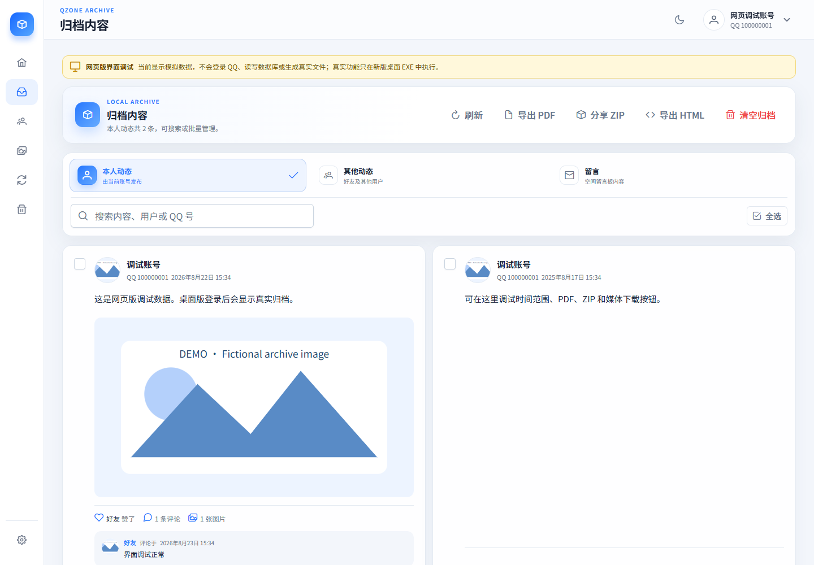
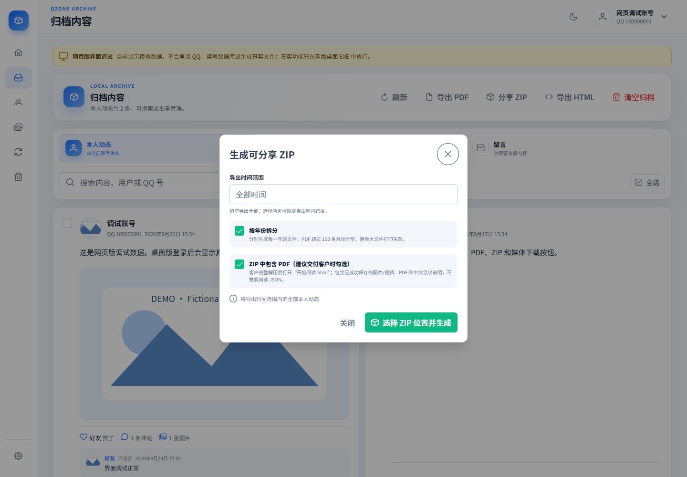
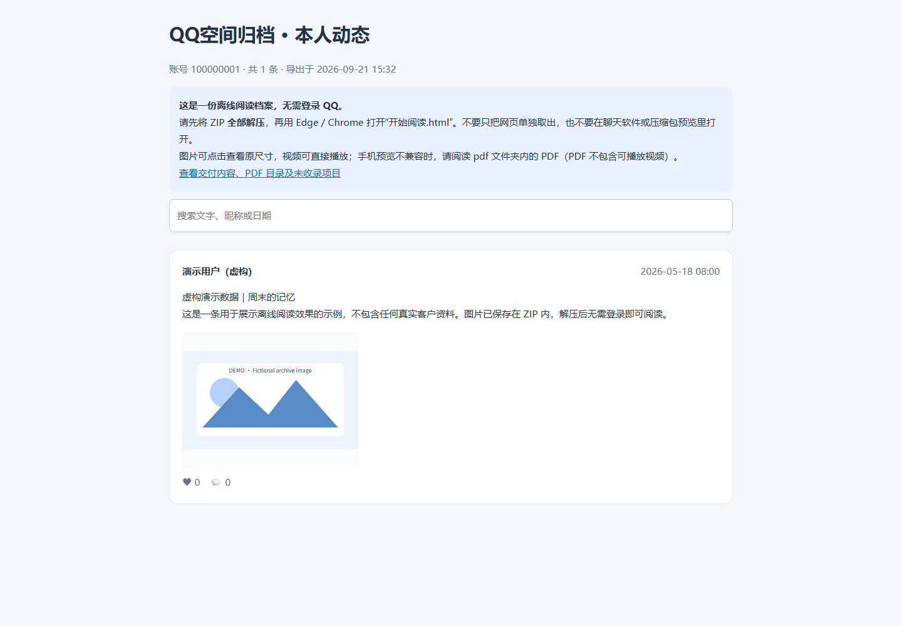
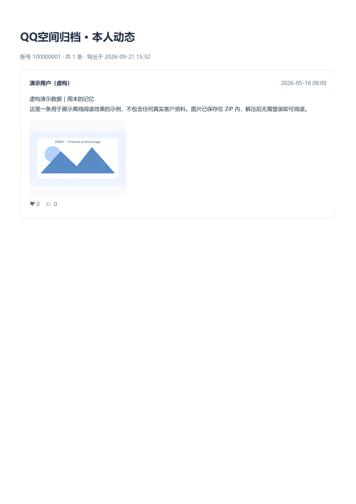

# QzoneArchive Offline · 空间归档离线交付版

把授权账号中能够获取的 QQ 空间记录整理为**可离线阅读的网页、PDF 和 ZIP**。重点解决“自己在软件里能看，发给别人却打不开”的交付问题。

基于 [Gaoshu705/QzoneArchive](https://github.com/Gaoshu705/QzoneArchive) 修改，保留 **GPLv3** 和原作者署名。这是独立衍生版本，不是原项目官方发布，也不是腾讯官方工具。

[下载 Windows 安装包](https://github.com/lix965996-art/QzoneArchive-Offline/releases/latest) · [使用指南](docs/USAGE.md) · [修改说明](docs/CHANGES.md) · [许可证](LICENSE)

## 可以做什么

- 按本人动态、其他动态、留言查看已归档内容，并保留正文与互动信息。
- 导出客户阅读 ZIP：`开始阅读.html`、本地媒体、可选 PDF 和中文 `导出说明.html`，不要求客户阅读 JSON。
- 离线正文和日期使用静态 HTML；即使脚本被禁用也能读。支持搜索、点击图片看完整尺寸、本地视频播放。
- PDF 可按年拆分；单组超过 100 条时自动分册，降低一次打印大量内容失败的风险。
- 优先复用已缓存媒体；支持请求方式回退、超时、取消、视频断点校验与安全替换旧文件。
- 在设置中选择数据目录；公开发行版使用独立应用标识，不默认覆盖原版的数据。

## 界面与结果

**以下图片全部使用虚构演示数据。操作界面取自网页演示模式，不代表访问了真实 QQ；结果页面和 PDF 由实际导出渲染器生成。**

### 1. 浏览归档与选择导出



### 2. 设置客户 ZIP 与 PDF



### 3. 解压后打开离线阅读页



### 4. PDF 阅读结果



## 快速使用

1. 从本仓库 [Releases](https://github.com/lix965996-art/QzoneArchive-Offline/releases) 下载 Windows x64 安装包。首次可能需要安装 Microsoft WebView2。
2. 登录本人或已获授权的 QQ 账号，按需要运行归档任务。请勿把客户登录凭证交给陌生人。
3. 在“归档内容”选择分类、时间范围或选中记录，点击“分享 ZIP”。建议勾选“ZIP 中包含 PDF”。
4. 等待完成后检查“导出说明.html”：确认哪些媒体已成功保存，哪些仍未收录，再交付。
5. 接收方**完整解压 ZIP**，用 Edge / Chrome 打开“开始阅读.html”。不要只取出 HTML，也不要依赖聊天软件或 ZIP 内的预览。

```text
交付包.zip
├── 开始阅读.html        # 客户阅读入口
├── index.html           # 同一份正文的通用文件名
├── 导出说明.html        # 范围、PDF 目录、未收录说明
├── 先读我.txt
├── media/               # 已成功保存的图片和视频
└── pdf/                 # 勾选 PDF 且生成成功时包含
```

手机不支持本地 HTML 时，优先阅读 PDF。**PDF 是静态阅读版，不能播放视频**；视频需在解压后的网页或播放器中打开。

## 不能承诺什么

- 不是“所有已删除内容必定找回”的工具。覆盖范围取决于 QQ 接口、账号权限与保存下来的历史信息。
- 旧媒体地址失效、访问限制、视频签名过期或网络中断都可能导致下载失败；返回占位图不一定代表原文件永久删除。
- 已彻底从服务端删除的文件无法保证恢复。未成功保存的媒体会如实标注，不会伪装成已交付。
- PDF 依赖本机 Microsoft Edge；移动端预览、浏览器视频编解码支持可能不同。
- 本分支针对 Windows x64 做了本地构建与验证；不声称 macOS、Linux、Android 已完成本次发行验证。
- 网页开发预览是 **Mock 演示模式**，不会抓取真实 QQ，也不会真的执行桌面导出。真实操作需要桌面版。

## 开发与构建

实际技术栈为 **Vue 3 + TypeScript + Vite + PrimeVue + Tauri 2 / Rust + SQLite**。

需要 Node.js 20+、支持本锁文件依赖的 Rust stable、Windows C++ 构建工具和 WebView2。Rust 依赖会随时间变化，请不要仅以旧版最低 Rust 版本判断兼容性。

```bash
npm ci
npm run build
npm run tauri dev
npm run tauri:build:windows
```

安装包通常生成在 `src-tauri/target/release/bundle/nsis/`。

```bash
cd src-tauri
cargo fmt --check
cargo check
cargo test --lib
```

需要 Edge 或真实归档样本的测试默认忽略。自动测试覆盖时间过滤、分册顺序、ZIP、安全替换、请求回退和视频断点传输等；测试通过不代表任意 QQ 账号、全部历史文件都能恢复。

## 隐私与授权

只处理本人或获明确授权的账号。导出包可能含昵称、QQ 号码、正文、图片和互动信息，请交付前核对范围并妥善保管。本仓库不包含真实客户归档、数据库、登录凭证、签名密钥或个人迁移配置。遇到限流请降低频率并稍后重试，不要绕过权限限制。

请勿在公开 Issue 上传 Cookie、登录二维码、客户 ZIP 或完整数据库。报告问题时提供版本、操作步骤、已脱敏错误即可。

## 来源与许可

原项目：[Gaoshu705/QzoneArchive](https://github.com/Gaoshu705/QzoneArchive)，感谢 Ehre、LibraHp_0928 及上游贡献者。本分支的归档基础、图标与原有界面来自上游；新增和调整部分见 [NOTICE](NOTICE) 与 [修改说明](docs/CHANGES.md)。

整体保留 [GNU GPL v3](LICENSE)，没有改成 Apache-2.0。传播修改版时请遵守随附许可证的源码及署名要求。

如果原项目对你有帮助，欢迎前往上游点 Star 支持作者。
